# Meridian Institute — Microsoft 365 Security Operations Lab
> **Status:** Portfolio Complete — v1.0

> A 6-phase, fully documented Microsoft 365 enterprise simulation built in a dedicated developer tenant with sanitized public evidence — covering identity governance, endpoint management, Defender XDR, Conditional Access, Purview DLP, and PowerShell automation across 27 lab users. Secure Score improved from 54 to 79 during the lab.

**Author:** Md Rahat Islam Anik · [linkedin.com/in/rahatislamanik](https://linkedin.com/in/rahatislamanik) · [github.com/rahatislamanik-spec](https://github.com/rahatislamanik-spec)

## Executive Snapshot

| Users Managed | Conditional Access Policies | Security Groups | Compliance Policies | Secure Score Improvement | Lab Phases |
| ------------: | --------------------------: | --------------: | ------------------: | -----------------------: | ---------: |
|            27 |                           9 |              5+ |                   3 |                  54 → 79 |          6 |

## Enterprise Architecture

```mermaid
flowchart TD
    subgraph Users["Meridian Institute — User Personas"]
        U1["Students"]
        U2["Faculty"]
        U3["IT Operations"]
        U4["Security Operations"]
    end

    subgraph Identity["Identity Foundation — Microsoft Entra ID"]
        E1["User Provisioning and RBAC"]
        E2["MFA and SSPR Configuration"]
        E3["Graph PowerShell Automation"]
        E4["Dynamic Security Groups"]
    end

    subgraph Policy["Access Control and Licensing"]
        P1["9 Conditional Access Policies — Report-Only Mode"]
        P2["M365 E3 and E5 License Assignment"]
        P3["MFA-Required-Users Security Group"]
    end

    subgraph Protection["Protection and Compliance Workloads"]
        PR1["Microsoft Intune — Compliance Policies and Security Baselines"]
        PR2["Exchange Online — Mail Security and Transport Rules"]
        PR3["Microsoft Purview — DLP Policies and Retention Labels"]
        PR4["Windows Autopilot — Zero-Touch Deployment Profiles"]
    end

    subgraph XDR["Security Operations — Microsoft Defender XDR"]
        X1["Secure Score Improved from 54 to 79"]
        X2["Incident and Alert Audit via PowerShell"]
        X3["Risky User and Sign-in Log Review"]
    end

    subgraph Outcomes["Enterprise Outcomes"]
        O1["27 Users Managed Across 4 Role Categories"]
        O2["Automated Onboarding Pipeline"]
        O3["100% Policy and Compliance Coverage"]
        O4["Governed, Protected and Monitored Environment"]
    end

    Users --> Identity
    Identity --> Policy
    Policy --> Protection
    Protection --> XDR
    XDR --> Outcomes

    classDef userStyle fill:#DBEAFE,stroke:#1D4ED8,stroke-width:3px,color:#1e3a5f
    classDef identityStyle fill:#EDE9FE,stroke:#6D28D9,stroke-width:3px,color:#3b0764
    classDef policyStyle fill:#FEF9C3,stroke:#B45309,stroke-width:3px,color:#451a03
    classDef protectionStyle fill:#F3E8FF,stroke:#7C3AED,stroke-width:3px,color:#2e1065
    classDef xdrStyle fill:#FEE2E2,stroke:#B91C1C,stroke-width:3px,color:#450a0a
    classDef outcomeStyle fill:#DCFCE7,stroke:#15803D,stroke-width:3px,color:#14532d

    class U1,U2,U3,U4 userStyle
    class E1,E2,E3,E4 identityStyle
    class P1,P2,P3 policyStyle
    class PR1,PR2,PR3,PR4 protectionStyle
    class X1,X2,X3 xdrStyle
    class O1,O2,O3,O4 outcomeStyle
```



### Executive Summary

📄 [Meridian Institute Executive Summary](docs/executive-summary/Meridian-Institute-Executive-Summary.pdf)

This project demonstrates a layered Microsoft 365 administration and security architecture covering identity governance, Conditional Access, endpoint management, compliance controls, Windows Autopilot deployment planning, Microsoft Defender XDR security operations, and Microsoft Graph PowerShell automation.


### Environment Summary

* Microsoft Entra ID identity governance and RBAC
* Microsoft Intune endpoint management and compliance
* Microsoft Defender XDR security operations
* Microsoft Purview DLP and compliance controls
* Exchange Online mail security configuration
* Microsoft Graph PowerShell automation
* Windows Autopilot zero-touch deployment planning

### Enterprise Architecture Overview


### Key Outcomes

* Managed and documented 27 enterprise users across multiple business roles
* Implemented and audited 9 Conditional Access policies
* Automated user onboarding and licensing using Microsoft Graph PowerShell
* Designed endpoint governance using Intune compliance policies and security baselines
* Implemented Purview DLP and retention controls
* Improved Microsoft Secure Score from 54 to 79
* Built a complete end-to-end Microsoft 365 operational lifecycle simulation


---

## Live Portfolio Pages

| Phase | Focus | Link |
|---|---|---|
| Phase 1 | Identity, Users, Groups, PowerShell, Sign-In Security | [View Phase 1 →](https://rahatislamanik-spec.github.io/Meridian-Institute-M365-Lab/phase-1/) |
| Phase 2 | Endpoint, Conditional Access, Purview DLP, Exchange | [View Phase 2 →](https://rahatislamanik-spec.github.io/Meridian-Institute-M365-Lab/phase-2/) |
| Phase 3 | Defender XDR Security Audit | [View Phase 3 →](https://rahatislamanik-spec.github.io/Meridian-Institute-M365-Lab/phase-3-defender-xdr/) |
| Phase 4 | User Onboarding Automation — Entra ID, Graph PowerShell, M365 Licensing | [View Phase 4 →](https://rahatislamanik-spec.github.io/Meridian-Institute-M365-Lab/phase-4-user-onboarding-automation/) |
| Phase 5 | Endpoint Compliance & Conditional Access Audit | [View Phase 5 →](https://rahatislamanik-spec.github.io/Meridian-Institute-M365-Lab/phase-5-endpoint-compliance/) |
| Phase 6 | Zero-Touch Deployment Architecture | [View Phase 6 →](https://rahatislamanik-spec.github.io/Meridian-Institute-M365-Lab/phase-6-zero-touch-deployment/) |

---

## What This Lab Demonstrates

This project simulates the full lifecycle of a Microsoft 365 environment buildout for a mid-size educational institution. Every configuration decision is documented through real admin portal screenshots, PowerShell output, and audit evidence — not tutorials or sandboxes.

The goal: prove hands-on competency across the exact tooling required for IT Support, M365 Administration, and Cloud Security Operations roles.

**Privacy note:** This repository uses a simulated organization and sanitized public tenant identifiers. No production users, customer data, passwords, tokens, or real organizational secrets are included.

For a phase-by-phase evidence index, see [docs/evidence-map.md](docs/evidence-map.md).

---

## Scope & Limitations

- This is a self-directed Microsoft 365 Developer Tenant lab, not a production deployment.
- Conditional Access policies were kept in Report-Only mode to avoid tenant lockout while still validating policy design and monitoring impact.
- Intune and Autopilot evidence documents policy configuration and architecture. No physical production device fleet was enrolled in this public lab.
- Phase 6 is a zero-touch deployment reference architecture that connects the implemented identity, onboarding, Conditional Access, Intune, and Defender work into an end-to-end operating model.

## Production Rollout Assumptions

If this lab were converted into a production rollout, the next controls would be required before enforcement:

- Maintain at least two cloud-only break-glass administrator accounts excluded from Conditional Access and monitored with alerting.
- Pilot Conditional Access with a small group first, review Report-Only impact, then move policies to enabled in staged rings.
- Keep a documented rollback path for each CA policy, including emergency disable steps and owner approval.
- Consolidate overlapping MFA policies before enforcement to reduce policy conflict and troubleshooting complexity.
- Enroll test Windows, macOS, iOS, and BYOD devices before using compliance state as an access requirement.
- Validate Autopilot with a physical or virtual Windows test device before treating zero-touch deployment as implemented.
- Confirm Microsoft licensing prerequisites for Entra ID, Intune, Defender, Purview, and Identity Protection features.

## Control Status Summary

| Area | Public Evidence Status | Notes |
|---|---|---|
| Entra users, groups, roles, and licensing | Implemented and validated | Lab users, RBAC assignments, group membership, and licensing were configured and checked with portal evidence and Graph PowerShell. |
| Conditional Access | Configured and monitored in Report-Only mode | Policies were staged safely for impact review; they were not enabled for production enforcement. |
| Intune compliance and security policies | Configured and documented | Policies and baselines were created, but no physical production device fleet was enrolled in this public lab. |
| Microsoft Purview DLP | Configured in simulation mode | DLP policies were designed and reviewed without production blocking. |
| Defender XDR / Secure Score | Audited and documented | Secure Score, control recommendations, risky users, alerts, and sign-in activity were reviewed through portal and Graph evidence. |
| Zero-touch deployment | Architecture design | Phase 6 documents the target operating model rather than a completed production deployment. |

---

## Phase 1 — Identity & Security Operations Baseline

**Admin Centers Used:** Microsoft 365 Admin Center · Microsoft Entra ID

### What Was Built

**Tenant Provisioning & User Management**
- Bulk-provisioned 27 users across 4 role categories (Students, Professors, IT Operations, Security Operations) with zero manual errors
- Created security groups with dynamic membership rules for automated role-based group assignment
- Identified and flagged 6 unlicensed student accounts using PowerShell Graph API filtering
- Assigned Microsoft 365 licenses programmatically via Graph PowerShell

**PowerShell Automation**
- Connected to Microsoft Graph using delegated scopes via Device Code flow
- Ran tenant-wide user, device, and group queries using `Get-MgUser`, `Get-MgGroup`, `Get-MgDevice`
- Exported audit reports (users, groups, licenses, sign-in logs) to CSV for documentation
- Validated all configurations via PowerShell output — no screenshot-only evidence

**Security Baseline & Readiness**
- Configured Microsoft Secure Score baseline tracking
- Reviewed sign-in logs and authentication methods across all user accounts
- Documented identity posture for Conditional Access readiness in Phase 2

---

## Phase 2 — Endpoint, Compliance & Access Security

**Admin Centers Used:** Microsoft Intune · Microsoft Entra ID · Microsoft Purview · Exchange Online

### What Was Built

**Endpoint Governance (Intune)**
- Created 3 Windows Autopilot deployment profiles scoped per persona (Students, Professors, IT Operations) — User-Driven, Entra-joined, OOBE-configured
- Configured macOS and iOS/iPadOS BYOD compliance policies with password, encryption, firewall, and OS version requirements
- Deployed Microsoft Security Baseline for Windows 11 (`Meridian-WIN11-Enterprise-Security-Baseline`, Version 25H2)
- Configured Windows Update ring (`Meridian-WIN11-Pilot-Update-Ring`) with 3-day quality deferral and 7-day feature deferral
- Built Attack Surface Reduction (ASR) rules policy for Windows endpoint baseline configuration

**Conditional Access (Entra ID)**
- Created 8 Conditional Access policies (all Report-Only — zero user disruption):
  - Require MFA for Admin Roles
  - Require MFA for Standard Users
  - Require MFA for All Users
  - Block Legacy Authentication
  - Require MDM-Enrolled and Compliant Device
  - Require Compliant or Hybrid Azure AD Joined Device
  - Require MFA for Admins (template-based)
  - Require MFA for All Users (template-based)
- Phase 5 later audited 9 total CA policies after adding a BYOD web-only access policy for SharePoint and Exchange review.
- Duplicate/template MFA variants were retained as lab evidence; in production these would be rationalized into a cleaner policy set.
- Created `MFA-Required-Users` security group for scoped CA targeting
- Configured SSPR (Self-Service Password Reset) for all users
- Assigned Helpdesk Administrator RBAC role to Helpdesk-Level1 group and Liam Thomas
- Documented Identity Secure Score: **76.30%**

**Microsoft Purview — Compliance & Data Governance**
- Created 2 custom DLP policies in Simulation mode
- Created Compliance Manager alert policies
- Reviewed NIST 800-137 Enterprise Governance Assessment
- Documented tenant Compliance Score: **56%**
- Created retention label: `Universal - Keep 7 Years Then Delete`

**Exchange Online — Mail Security**
- Provisioned IT Helpdesk shared mailbox
- Created `Block External Auto-Forwarding` transport rule
- Documented mail security stack: anti-spam, anti-malware, Safe Attachments, Safe Links, DKIM

---

## Phase 3 — Defender XDR Security Audit

**Tools:** Microsoft Defender XDR · Microsoft Graph PowerShell · PowerShell 7

### What Was Built

- Audited Defender XDR security posture across the tenant
- Reviewed Microsoft Secure Score and Identity Secure Score
- Exported incident, alert, and recommendation data via PowerShell
- Generated 3 CSV audit reports: incidents, alerts, recommendations
- Documented Secure Score baseline for ongoing security monitoring

---

## Phase 4 — User Onboarding Automation

**Tools:** Microsoft Entra ID · Microsoft Graph PowerShell · Microsoft 365 E3

### What Was Built

- Created 5 department security groups (Meridian-HR, Finance, Faculty, IT, Administration)
- Automated user provisioning and group assignment via Graph PowerShell
- Onboarded test user Sarah Johnson: user creation, HR group assignment, usage location, M365 E3 license
- Validated user access: MFA registration, Outlook, M365 portal, SharePoint, OneDrive, Teams
- Exported group assignment and onboarding evidence to CSV
- 14 screenshots documenting the full onboarding lifecycle

---

## Phase 5 — Endpoint Compliance & Conditional Access Audit

**Tools:** Microsoft Intune · Microsoft Entra ID · Microsoft Graph PowerShell

### What Was Built

- Audited 9 Conditional Access policies (all Report-Only mode)
- Reconciled CA policy growth from Phase 2: the audit includes the later BYOD web-only access policy
- Reviewed 3 Intune compliance policies: iOS BYOD, WIN11 Faculty-Staff, WIN11 Standard
- Queried managed device compliance posture across the tenant
- Generated 3 CSV reports: conditional-access-policies, intune-compliance-policies, managed-devices
- 4 screenshots: script execution, audit summary output, CA policies portal, Intune compliance portal

---

## Phase 6 — Zero-Touch Deployment Architecture

**Focus:** End-to-end automated endpoint lifecycle architecture

### What Was Designed

- Designed the full zero-touch deployment workflow integrating all prior phases
- Architecture covers: Entra ID → Department Groups → M365 Licensing → Conditional Access → Intune Enrollment → Windows Autopilot → Defender → Windows 11 endpoint
- Demonstrated how Sarah Johnson's onboarding would flow through the complete automated pipeline
- Documents the business outcome: standardized onboarding, improved endpoint security, reduced IT operational effort

---

## Repository Structure

```
Meridian-Institute-M365-Lab/
├── README.md
├── phase-1/
├── phase-2/
├── phase-3-defender-xdr/
│   ├── scripts/
│   ├── reports/
│   └── screenshots/
├── phase-4-user-onboarding-automation/
│   ├── reports/
│   └── screenshots/
├── phase-5-endpoint-compliance/
│   ├── scripts/
│   ├── reports/
│   └── screenshots/
├── phase-6-zero-touch-deployment/
└── docs/
    └── evidence-map.md
```

---

## Tech Stack

| Tool | Purpose |
|---|---|
| Microsoft 365 Developer Tenant | Dedicated simulated lab tenant with sanitized public identifiers |
| Microsoft Entra ID | Identity, RBAC, Conditional Access, SSPR |
| Microsoft Intune | Autopilot, compliance policies, security baseline, update rings |
| Microsoft Purview | DLP, Compliance Manager, retention labels |
| Exchange Online | Shared mailbox, transport rules, mail security |
| Microsoft Defender XDR | Security operations, Secure Score, incident management |
| PowerShell 7 + Microsoft Graph SDK | Automation, validation, reporting |
| HTML / CSS / JavaScript | Portfolio evidence pages |
| GitHub Pages | Live hosting |

---

## Certifications Referenced

- AZ-900: Microsoft Azure Fundamentals
- MS-900: Microsoft 365 Fundamentals
- Cisco Networking Essentials
- Anthropic Claude Code in Action
- Anthropic AI Fluency & Framework

---

*Independently designed and executed as a self-directed enterprise simulation — replicating the real-world Microsoft 365 administration challenges faced by IT Operations and Cloud Security teams in mid-size organizations. Every configuration was planned, deployed, validated, and documented without guidance, demonstrating job-ready competency across the Microsoft 365 ecosystem.*

---

## 🌐 Portfolio Ecosystem

This project is part of a multi-repo enterprise IT portfolio covering the full IT lifecycle.

| Layer | Project | Focus |
|---|---|---|
| 01 — Network Foundation | [Enterprise IT Network Diagnostics Toolkit](https://github.com/rahatislamanik-spec/Enterprise-IT-Network-Diagnostics-Toolkit) | DNS · Connectivity · Network Diagnostics |
| 02 — User Lifecycle | [Project Arabesque](https://github.com/rahatislamanik-spec/Project-Arabesque) | Onboarding · Offboarding · M365 Automation |
| 03 — Identity & Security | [Enterprise IT Security Operations Toolkit](https://github.com/rahatislamanik-spec/Enterprise-IT-Security-Operations-Toolkit) | Entra ID · Intune · Defender · Zero Trust |
| 04 — M365 Operations | **You are here** | Exchange · Teams · SharePoint · Purview |

👉 [View Full Portfolio](https://rahatislamanik-spec.github.io/IT-Portfolio-Rahat-Islam-Anik/)
