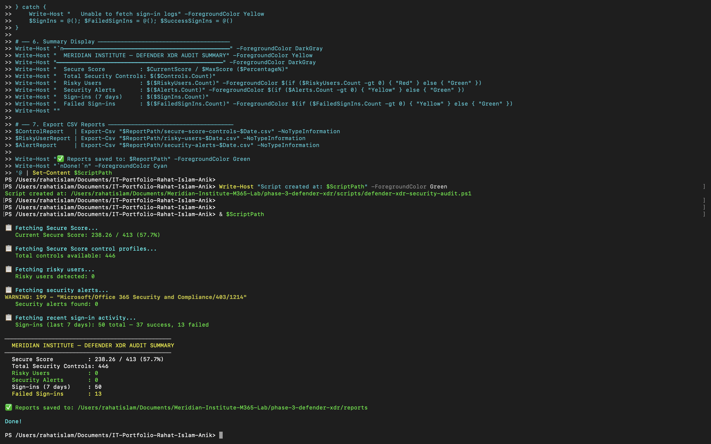
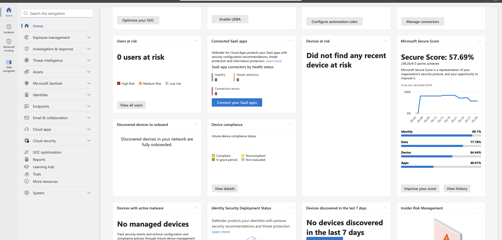

# Phase 3 — Microsoft Defender XDR Security Audit

> **Meridian Institute — Microsoft 365 Security Operations Lab**
> Simulated enterprise environment using a dedicated Microsoft 365 Developer Tenant with sanitized public identifiers

---

## 📋 Project Overview

This phase implements an automated **Microsoft Defender XDR security posture audit** using PowerShell and Microsoft Graph. The objective is to assess the Meridian Institute's security posture across Secure Score, identity risk, security alerts, and authentication activity — producing structured CSV reports for governance and compliance review.

### Business Problem

Security teams in modern organizations need continuous visibility into:

- How their security posture compares against Microsoft's recommended controls
- Whether any users are flagged as risky by Microsoft's identity protection signals
- Active security alerts requiring investigation and remediation
- Authentication patterns — failed sign-ins that may indicate brute force or compromised accounts
- Which security controls are implemented vs outstanding

Without automated auditing, this visibility requires manual navigation across multiple admin portals — Defender, Entra ID, Purview — with no structured output or historical comparison.

### Solution

A single PowerShell script connecting to Microsoft Graph that performs a complete security posture audit — Secure Score, control profiles, risky users, security alerts, and sign-in activity — exported to 3 structured CSV reports.

---

## 🛠️ Technologies Used

| Tool | Purpose |
|---|---|
| Microsoft Defender XDR | Security incidents, alerts, and Secure Score |
| Microsoft Graph API | Security data retrieval |
| PowerShell 7+ | Script execution and report generation |
| Entra ID Identity Protection | Risky user detection |
| Azure AD Sign-in Logs | Authentication activity analysis |
| Get-MgSecuritySecureScore | Secure Score data |
| Get-MgSecuritySecureScoreControlProfile | Security control inventory |
| Get-MgRiskyUser | Identity risk signals |
| Get-MgSecurityAlert | Security alert enumeration |
| Get-MgAuditLogSignIn | Sign-in activity audit |

**Required Graph Scopes:** `SecurityEvents.Read.All`, `SecurityActions.Read.All`, `IdentityRiskyUser.Read.All`, `Policy.Read.All`, `AuditLog.Read.All`, `Directory.Read.All`

---

## 🔧 Script — `defender-xdr-security-audit.ps1`

Performs 5 sequential security audit checks:

**1. Secure Score Audit**
Retrieves the tenant's current Microsoft Secure Score — a weighted measure of security posture across identity, devices, apps, and data. Captures current score, maximum possible score, and percentage.

**2. Security Control Profile Inventory**
Enumerates all 446 available security controls — documenting category, action type, service, maximum score contribution, implementation tier, user impact, and associated threats.

**3. Risky User Detection**
Queries Microsoft Identity Protection for users flagged as risky — capturing risk level (low/medium/high), risk state, risk detail, and last updated timestamp. Requires Entra ID P2 licensing for full functionality.

**4. Security Alert Audit**
Retrieves all active security alerts from Microsoft Defender — capturing title, severity, status, category, creation date, and provider. Alerts represent active threats or suspicious activity requiring investigation.

**5. Sign-in Activity Analysis**
Pulls the last 50 sign-in events from the audit log — distinguishing successful from failed authentications. Failed sign-ins (Error Code ≠ 0) flag potential brute force attempts, account lockouts, or MFA failures.

---

## 📊 Lab Audit Results

From the Meridian Institute M365 Developer Tenant:

| Finding | Result | Status |
|---|---|---|
| **Secure Score** | **238.26 / 413 (57.7%)** | ✅ Active baseline |
| Security Controls Available | 446 | ✅ Full inventory |
| Risky Users | 0 | ✅ Clean |
| Security Alerts | 0 | ✅ Clean |
| Sign-ins (Last 7 Days) | 50 | ✅ Active tenant |
| **Failed Sign-ins** | **13** | ⚠️ Requires investigation |

**Key findings:**

**Secure Score 57.7%** — A score of 238.26 out of 413 indicates a solid security baseline with significant room for improvement. The 446 available controls provide a clear roadmap for security hardening initiatives.

**13 failed sign-ins** — Out of 50 sign-in attempts in 7 days, 13 (26%) failed. This rate warrants investigation — failed sign-ins can indicate incorrect passwords, MFA challenges, Conditional Access blocks, or external brute force attempts. In a production environment this would trigger an alert and investigation workflow.

**0 risky users and 0 alerts** — The tenant has no currently flagged identity risks or active security incidents, confirming a clean security state at the time of audit.

---

## 📁 Repository Structure

```
phase-3-defender-xdr/
├── scripts/
│   └── defender-xdr-security-audit.ps1
├── reports/
│   ├── secure-score-controls-2026-05-31.csv
│   ├── risky-users-2026-05-31.csv
│   └── security-alerts-2026-05-31.csv
├── screenshots/
└── README.md
```

---

## 📸 Implementation Screenshots

### 1. Script Execution — Full Audit Summary
Complete script execution showing Microsoft Graph connection, all 5 audit sections, and the final Defender XDR summary — Secure Score 238.26/413, 13 failed sign-ins detected.



---

### 2. CSV Reports Generated
Three CSV reports generated in the reports directory — secure score controls, risky users, and security alerts.


---

### 3. Microsoft Defender — Overview Dashboard
Microsoft Defender XDR portal showing the security operations overview for the Meridian Institute tenant.



---

### 4. Microsoft Secure Score
Secure Score dashboard showing the tenant's current score of 238.26 / 413 (57.7%) with improvement recommendations.


---

### 5. Entra ID — Sign-in Logs
Sign-in logs showing the 50 recent authentication events — including the 13 failed sign-ins flagged by the audit script.


---

## 🎯 Key Outcomes

- ✅ Secure Score baseline established: 238.26 / 413 (57.7%)
- ✅ 446 security controls inventoried — full improvement roadmap available
- ✅ 0 risky users — clean identity risk posture
- ✅ 0 security alerts — no active incidents
- ⚠️ 13 failed sign-ins detected — authentication anomaly flagged for investigation
- ✅ 3 CSV reports exported via PowerShell and Microsoft Graph

---

## 💼 Real-World Relevance

Defender XDR security audits are a standard responsibility for:

- **M365 Administrators** — maintaining Secure Score above organizational benchmarks
- **Security Operations teams** — triaging alerts and risky user signals daily
- **IT Managers** — reporting security posture to leadership and compliance teams
- **Cloud Administrators** — implementing Secure Score recommendations

The 13 failed sign-ins finding directly maps to a real SOC workflow: investigate the source IPs, check if accounts are targeted, verify Conditional Access is blocking appropriately, and determine if MFA is enforcing correctly.

---

## 🔗 Related Phases

| Phase | Topic |
|---|---|
| [Phase 1](../phase-1-tenant-provisioning-identity-governance/) | Tenant Provisioning & Identity Governance |
| [Phase 2](../phase-2-endpoint-security-compliance/) | Endpoint Security & Compliance |
| **Phase 3** | **Defender XDR Security Audit** ← You are here |

---

*Built by Md Rahat Islam Anik — Cloud Computing & Network Administration Graduate, George Brown Polytechnic*
*[LinkedIn](https://linkedin.com/in/rahatislamanik) • [GitHub](https://github.com/rahatislamanik-spec)*
