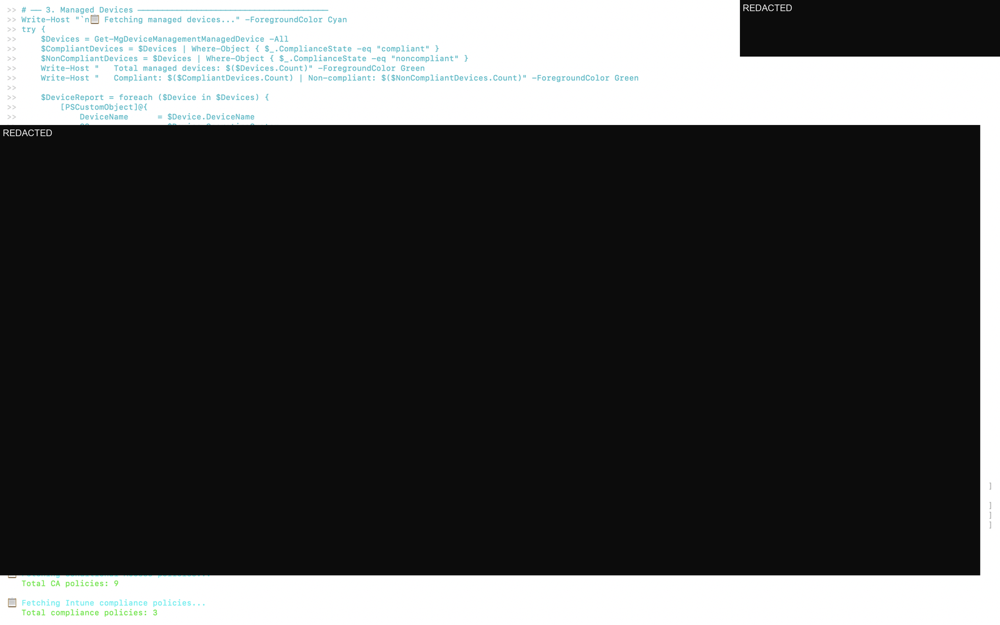
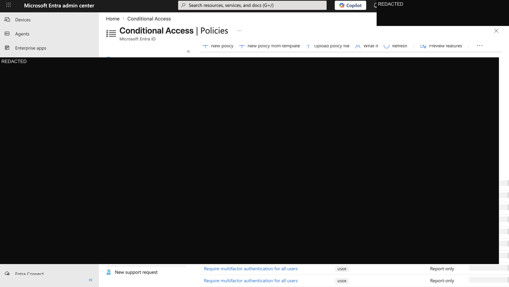
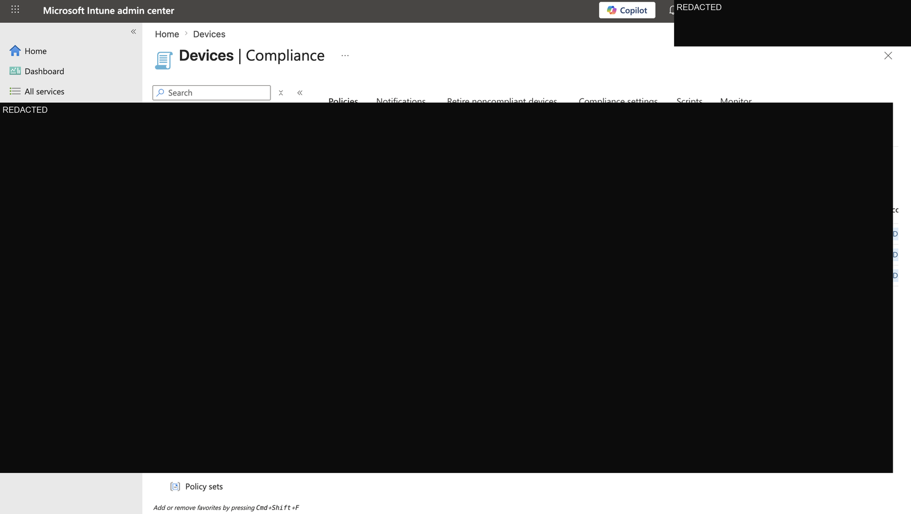
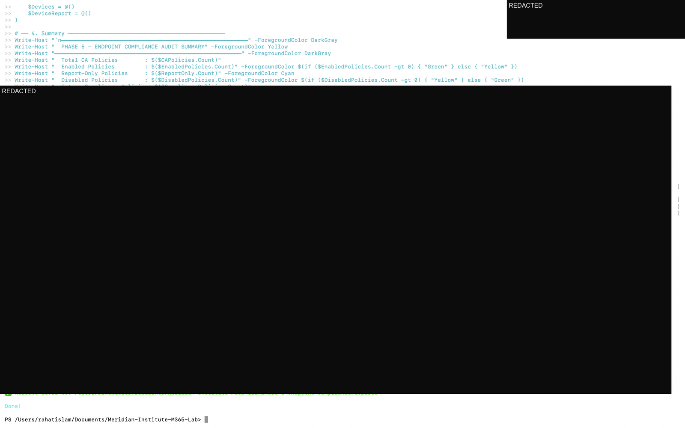

# Phase 5 — Endpoint Compliance & Conditional Access Audit

> **Meridian Institute — Microsoft 365 Security Operations Lab**
> Simulated enterprise environment using a dedicated Microsoft 365 Developer Tenant with sanitized public identifiers

---

## 📋 Project Overview

This phase implements an automated **Endpoint Compliance and Conditional Access audit** using PowerShell and Microsoft Graph. The objective is to assess the Meridian Institute's device governance posture — documenting all Conditional Access policies, Intune compliance policies, and managed device status across the tenant.

### Business Problem

Without a structured audit process, IT administrators have no centralized view of:
- Which Conditional Access policies are active vs report-only vs disabled
- What compliance requirements are configured across device platforms
- How many devices are compliant vs non-compliant at any point in time
- Whether CA policies align with the organization's Zero Trust security requirements

### Solution

A PowerShell script connecting to Microsoft Graph that audits all CA policies, Intune compliance policies, and managed devices — producing 3 structured CSV reports for governance review.

---

## 🛠️ Technologies Used

| Tool | Purpose |
|---|---|
| Microsoft Graph API | CA policy and device data retrieval |
| PowerShell 7+ | Script execution and report generation |
| Microsoft Entra ID | Conditional Access policy engine |
| Microsoft Intune | Device compliance policy management |
| Get-MgIdentityConditionalAccessPolicy | CA policy enumeration |
| Get-MgDeviceManagementDeviceCompliancePolicy | Compliance policy enumeration |
| Get-MgDeviceManagementManagedDevice | Device inventory |

**Required Graph Scopes:** `Policy.Read.All`, `DeviceManagementConfiguration.Read.All`, `Directory.Read.All`

---

## 🔧 Script — `endpoint-compliance-audit.ps1`

Performs 3 sequential audit checks:

**1. Conditional Access Policy Audit**
Enumerates all CA policies — capturing policy name, state (enabled/report-only/disabled), target users, target applications, grant controls (MFA, compliant device), and session controls.

**2. Intune Compliance Policy Audit**
Enumerates all device compliance policies — capturing policy name, target platform (Windows, iOS, macOS, Android), creation date, and description.

**3. Managed Device Inventory**
Queries all Intune-managed devices — capturing device name, OS, version, compliance state, assigned user, last sync time, and management agent.

---

## 📊 Lab Audit Results

From the Meridian Institute M365 Developer Tenant:

| Finding | Result | Status |
|---|---|---|
| Total CA Policies | 9 | ✅ Comprehensive coverage |
| Enabled Policies | 0 | ✅ Report-only mode (safe lab) |
| **Report-Only Policies** | **9** | ✅ All policies in monitoring mode |
| Disabled Policies | 0 | ✅ No orphaned policies |
| Intune Compliance Policies | 3 | ✅ Multi-platform coverage |
| Managed Devices | 0 | ✅ Expected in lab environment |

**Key findings:**

**9 Conditional Access policies — all in Report-Only mode.** This is best practice for a lab environment — policies are fully configured and monitored but not enforced, preventing accidental lockouts during testing. In a production deployment, high-priority policies (MFA for admins, block legacy auth) would be moved to Enabled.

This audit shows 9 policies because it includes the additional BYOD web-only access policy added after the initial Phase 2 build. The lab intentionally preserves template-based and custom MFA variants as evidence; a production tenant would consolidate overlapping policies before enforcement.

**3 Intune compliance policies** — covering the three device platforms configured in Phase 2: iOS/iPadOS BYOD, Windows Standard, and Windows Faculty/Staff. These policies define the compliance requirements devices must meet before CA policies grant access.

**0 managed devices** — expected in a developer tenant with no physical devices enrolled. In production, this view would show all enrolled endpoints with their compliance status.

---

## 📁 Repository Structure

```
phase-5-endpoint-compliance/
├── scripts/
│   └── endpoint-compliance-audit.ps1
├── reports/
│   ├── conditional-access-policies-2026-06-02.csv
│   ├── intune-compliance-policies-2026-06-02.csv
│   └── managed-devices-2026-06-02.csv
├── screenshots/
└── README.md
```

---

## 📸 Implementation Screenshots

### 1. Script Execution — Audit Summary
Full script execution showing Microsoft Graph connection, CA policy enumeration (9 policies), Intune compliance policy fetch (3 policies), and managed device query.



---

### 2. Conditional Access Policies — Entra Portal
Microsoft Entra ID Conditional Access portal showing all 9 policies in report-only state — MFA requirements, device compliance access review, and legacy authentication blocking strategy.



---

### 3. Intune Compliance Policies
Microsoft Intune compliance policies showing the 3 platform-specific policies configured for Meridian Institute — iOS BYOD, Windows Standard, and Windows Faculty/Staff.



---

### 4. PowerShell Audit Summary Output
Terminal output showing the completed audit summary and report-generation status.



---

## 🎯 Key Outcomes

- ✅ 9 Conditional Access policies audited — full policy inventory with state classification
- ✅ 3 Intune compliance policies documented — multi-platform device governance
- ✅ All CA policies in Report-Only mode — safe monitoring without enforcement risk
- ✅ 0 disabled policies — clean policy hygiene, no orphaned configurations
- ✅ 3 CSV reports exported via PowerShell and Microsoft Graph
- ✅ Compliance posture baseline established for Phase 6 zero-touch deployment design

---

## 💼 Real-World Relevance

Endpoint compliance auditing is a core responsibility for:

- **M365 Administrators** — ensuring CA policies are correctly configured, monitored, and safely moved toward enforcement
- **Security Operations teams** — monitoring device compliance posture daily
- **IT Managers** — reporting compliance coverage to leadership
- **Cloud Administrators** — validating Zero Trust access controls are in place

The report-only CA policy finding is particularly valuable — it demonstrates understanding of safe policy deployment practices. Moving policies from report-only to enabled is a deliberate, staged process in production environments.

---

## 🔗 Related Phases

| Phase | Topic |
|---|---|
| [Phase 1](../phase-1/) | Identity & Security Operations Baseline |
| [Phase 2](../phase-2/) | Endpoint, Compliance & Access Security |
| [Phase 3](../phase-3-defender-xdr/) | Defender XDR Security Audit |
| [Phase 4](../phase-4-user-onboarding-automation/) | User Onboarding Automation |
| **Phase 5** | **Endpoint Compliance & CA Audit** ← You are here |
| [Phase 6](../phase-6-zero-touch-deployment/) | Zero-Touch Deployment Architecture |

---

*Built by Md Rahat Islam Anik — Cloud Computing & Network Administration Graduate, George Brown Polytechnic*
*[LinkedIn](https://linkedin.com/in/rahatislamanik) · [GitHub](https://github.com/rahatislamanik-spec) · [Portfolio](https://rahatislamanik-spec.github.io/IT-Portfolio-Rahat-Islam-Anik/)*
